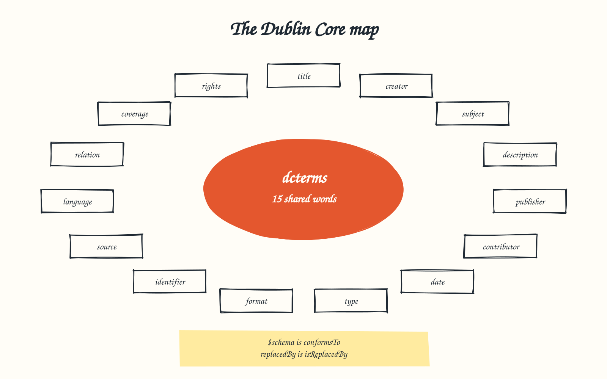

# Dublin Core



The file's metadata keys are [Dublin Core](https://www.dublincore.org/specifications/dublin-core/dcmi-terms/)
terms, so a tool that knows Dublin Core already knows what `title`, `creator`
or `modified` mean. The JSON stays plain JSON: the mapping lives in a separate
JSON-LD context, [`0.9/context.jsonld`](0.9/context.jsonld), which any JSON-LD
processor can apply to turn a file into linked data. Every term below is in the
`dcterms:` namespace, `http://purl.org/dc/terms/`.

## The fifteen elements

| Element | In `lifecycle-policies.json` | In the documents a policy governs |
| --- | --- | --- |
| `title` | `title` (REQUIRED): the policy set's name | The document's title |
| `creator` | `creator`: who authored the policy set | The document's author |
| `subject` | `subject`: keywords | The document's keywords |
| `description` | `description` on the file; each policy's `notes` also maps to `dcterms:description` | The document's summary |
| `publisher` | `publisher`: the repository or organisation publishing the policy set | |
| `contributor` | `contributor`: others who contributed | Approvers recorded in sign-offs |
| `date` | Refined as `created` (`dcterms:created`) and `modified` (`dcterms:modified`, REQUIRED) | Transition dates; see [DCMI terms](#dcmi-terms) |
| `type` | Each policy's `type` is the governed document type (`dcterms:type`) | The document's type |
| `format` | The file is `application/json`. This is stated here rather than in the context, because a JSON-LD context maps keys and cannot assert a fact about the file itself. GitHub Pages serves the schema as `application/json` and the context as `application/ld+json`. | Usually `text/markdown` |
| `identifier` | `identifier` (REQUIRED): a persistent URI such as an ARK | The document's identifier |
| `source` | `source`: the policy set this one was derived from | |
| `language` | `language`: BCP 47 tag for `description` and `notes` | |
| `relation` | Refined as `requires` (`rolesRef`) and `references` (`references`) | `references`, `requires`, `isPartOf` |
| `coverage` | `coverage`: what the policy set governs, such as a repository or path globs | |
| `rights` | `rights`: the policy set's licence, ideally an SPDX identifier | |

## DCMI terms

Beyond the fifteen elements, the context maps these DCMI terms:

| Term | Key | Meaning |
| --- | --- | --- |
| `conformsTo` | `$schema` | Which released version of the standard the file conforms to |
| `hasVersion` | `version` | The policy set's own version, separate from the standard version |
| `created` | `created` | When the policy set was first created |
| `modified` | `modified` | When the policy set last changed |
| `requires` | `rolesRef` | The role catalogue the policy set depends on |
| `references` | `references` | Related resources |
| `isReplacedBy` | `vocabulary.triggeredBy.retired[].replacedBy` | The token that replaces a retired one |

## Terms for the governed documents

The policy file describes how documents move. When a document makes a
transition, the document itself SHOULD record the matching DCMI term, so its
history reads the same way in every repository. These are not keys in
`lifecycle-policies.json`; [Workflows](workflows.md) shows them on each
transition.

| Term | Record it when |
| --- | --- |
| `created` | The document is created, in its opening status |
| `dateSubmitted` | It moves into review |
| `dateAccepted` | It is approved or accepted |
| `modified` | Any other transition, such as delivered, mitigated, closed or archived |
| `isReplacedBy` / `replaces` | It is superseded: the old document names its successor, and the successor names what it replaces |
| `valid` | A period of validity, such as a retired token's `deprecatedAt` to `removedAt` window |
| `available` | A released version of something, such as a standard version, became available |

## Terms the standard defines itself

Keys with no Dublin Core equivalent map to the standard's own namespace,
`https://jamie-clayton.github.io/githerd-rules/lifecycle-policies/0.9/terms#`:
`policies`, `field`, `validStatuses`, `transitions`, `from`, `to`,
`triggeredBy`, `approverRoles`, `vocabulary`, `roles`, `active`, `retired`,
`value`, `deprecatedAt`, `removedAt`, `deprecationWindow`, `unit`, `length`,
`fieldContract`, `rule`, `rationale`, `appliesTo` and `extensions`.
`extensions` is kept as an opaque JSON value, so arbitrary extension data
cannot break the mapping.

## Using the context

The file carries no `@context` of its own, so it stays plain JSON. Apply the
context when you need linked data, for example with
[jsonld.js](https://github.com/digitalbazaar/jsonld.js):

```js
import jsonld from 'jsonld';
const context = await (await fetch('https://jamie-clayton.github.io/githerd-rules/lifecycle-policies/0.9/context.jsonld')).json();
const expanded = await jsonld.expand(policies, { expandContext: context });
```

The conformance suite expands the full example this way on every change, and
checks that all 19 Dublin Core terms the context maps appear in the result.

---

Licensed Apache-2.0, see [LICENSE.md](../LICENSE.md).
