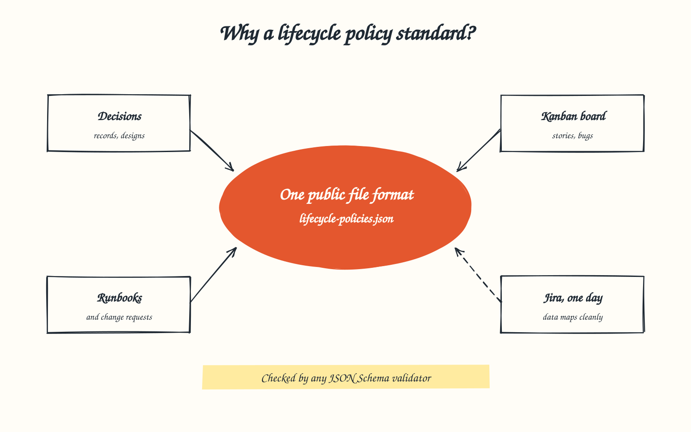
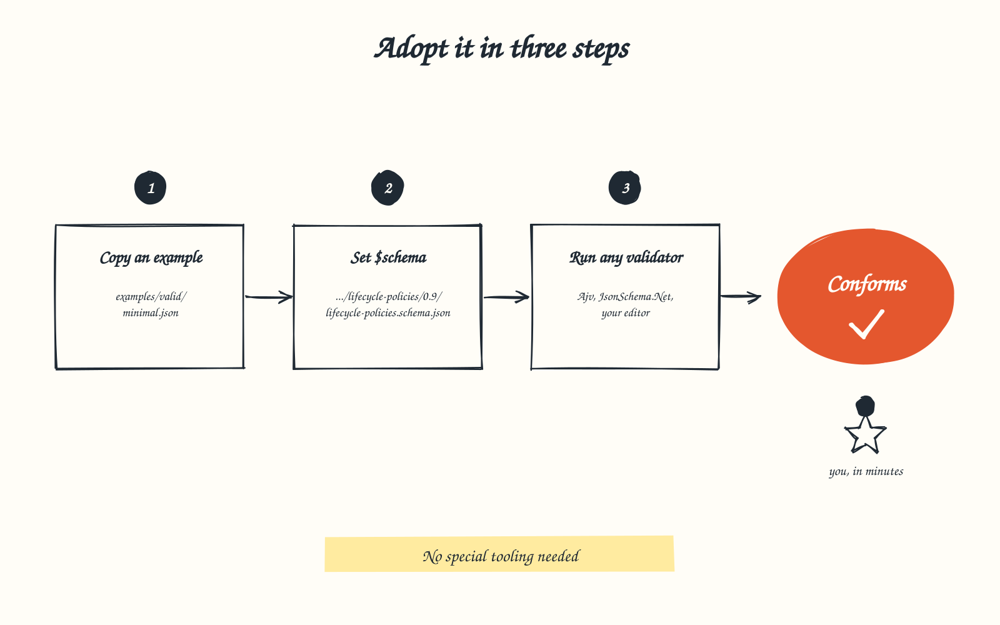
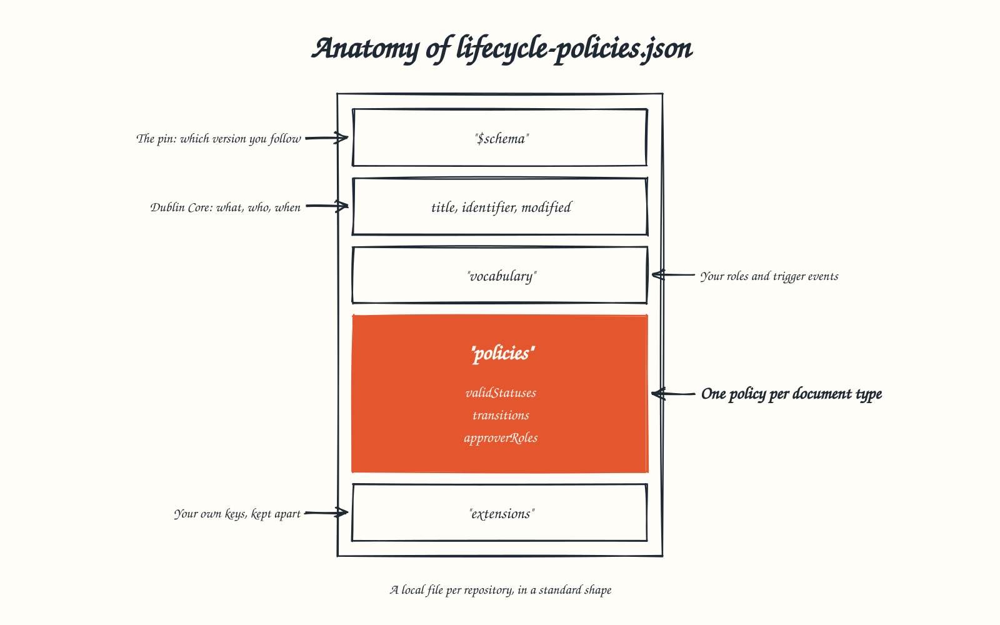

# Lifecycle Policy Standard



**Version 0.9, pre-release.** Published for testing before 1.0.

A repository full of decision records, designs, plans and risks needs to say,
for each kind of document, which statuses it may hold, how it moves between
them, what triggers each move, and who approves it. The Lifecycle Policy
Standard is one JSON format for saying that, so the answer can be read and
checked by any tool rather than living in one tool's private config.

## Who it is for

- **Repository maintainers** who want document lifecycles written down and
  checked, not remembered.
- **Tool builders** who read or enforce those lifecycles: dashboards, linters,
  agents, bots.
- **Teams that may later connect to Jira** or another work tracker, and want
  their data to map cleanly when they do. See [Jira mapping](jira.md).

Githerd and Gelato use it. Neither owns it.

## Adopt it in three steps



1. **Copy an example.** Start from
   [`minimal.json`](0.9/examples/valid/minimal.json), or from the
   [full example](0.9/examples/valid/full-dublin-core.json) that uses every
   key, and save it as `lifecycle-policies.json` in your repository.
2. **Set `$schema`** to the released version:

   ```json
   "$schema": "https://jamie-clayton.github.io/githerd-rules/lifecycle-policies/0.9/lifecycle-policies.schema.json"
   ```

3. **Run any JSON Schema 2020-12 validator**, or open the file in an editor that
   reads `$schema`. Then check the five [semantic rules](spec.md#semantic-rules)
   the schema cannot express.

## What is in the file



## Read more

- [Specification](spec.md): every key, the conformance rules, versioning.
- [Workflows](workflows.md): worked lifecycles for initiatives, decision
  records, designs and risks.
- [Dublin Core](dublin-core.md): how every key maps to a Dublin Core term.
- [Jira mapping](jira.md): how the data lines up with Jira workflows.
- [Models and APIs](models.md): generating C# and TypeScript, and describing
  REST APIs.

## Files for version 0.9

| File | What it is |
| --- | --- |
| [`lifecycle-policies.schema.json`](0.9/lifecycle-policies.schema.json) | The JSON Schema 2020-12 definition |
| [`context.jsonld`](0.9/context.jsonld) | JSON-LD context mapping keys to Dublin Core |
| [`vocabulary.json`](0.9/vocabulary.json) | The core trigger events |
| [`examples/`](https://github.com/Jamie-Clayton/githerd-rules/tree/main/lifecycle-policies/0.9/examples) | Valid and invalid conformance examples |

---

Licensed Apache-2.0, see [LICENSE.md](../LICENSE.md).
