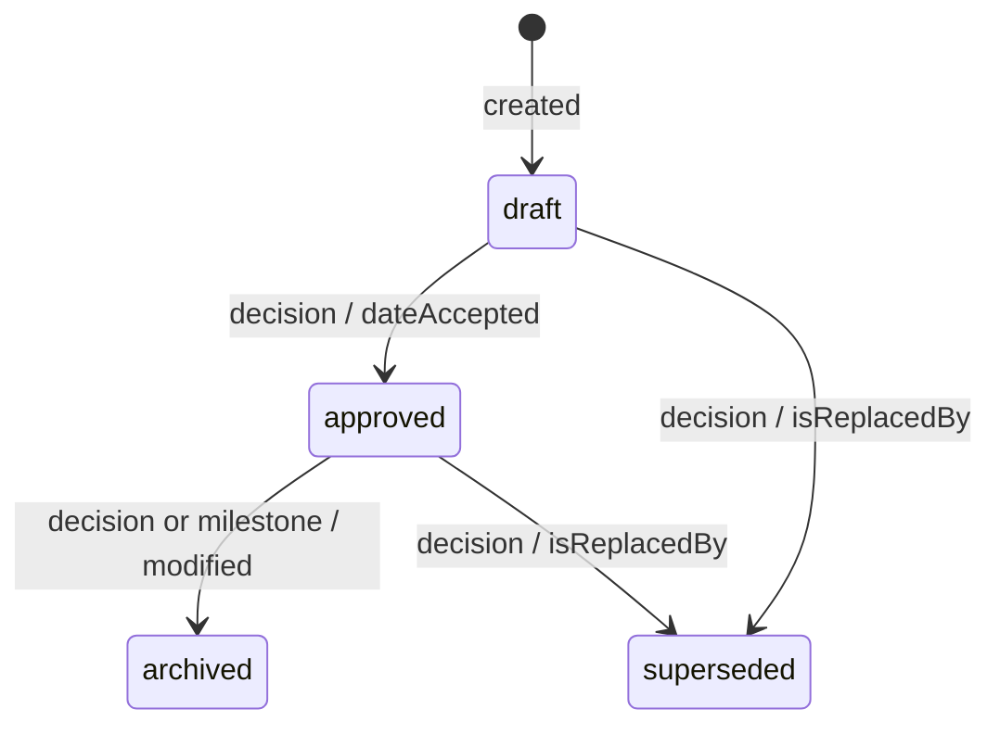
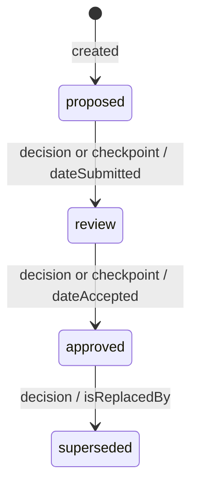
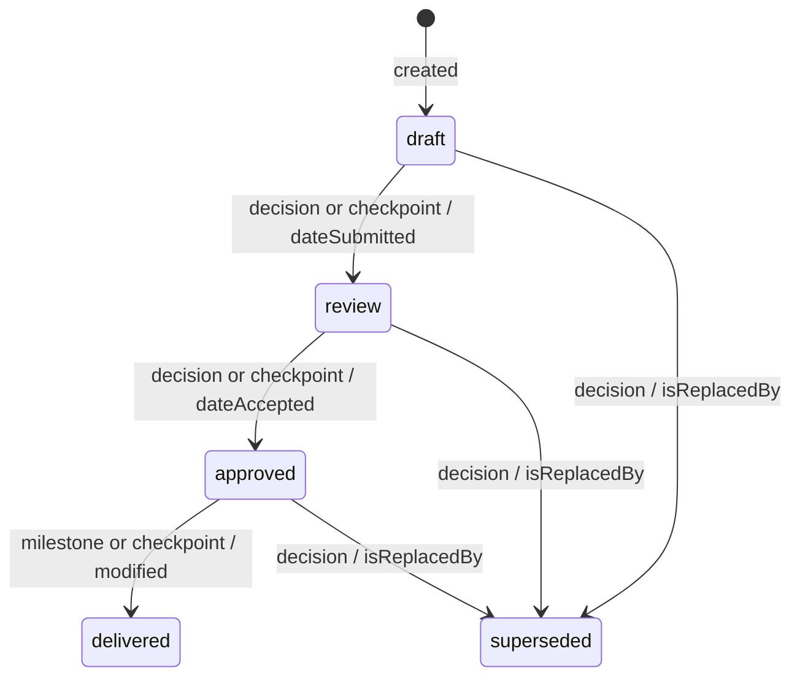
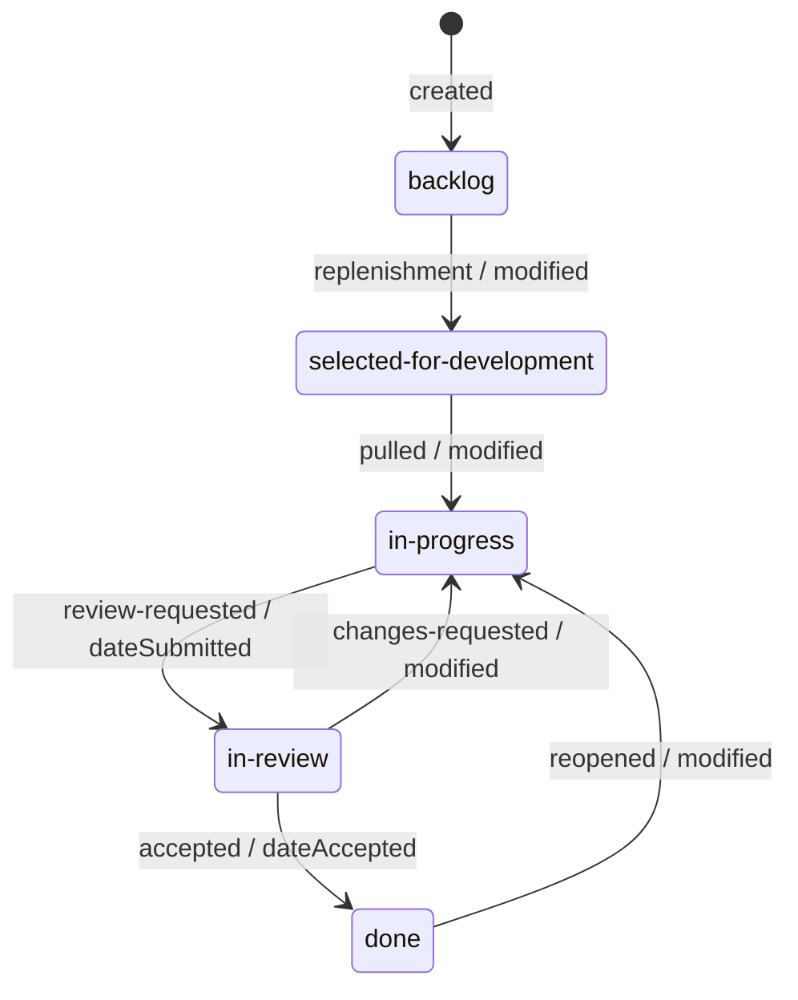
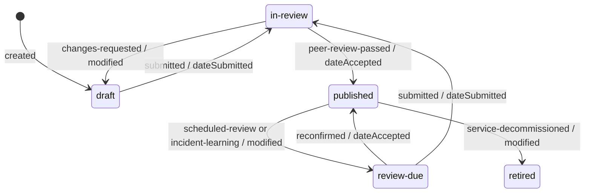
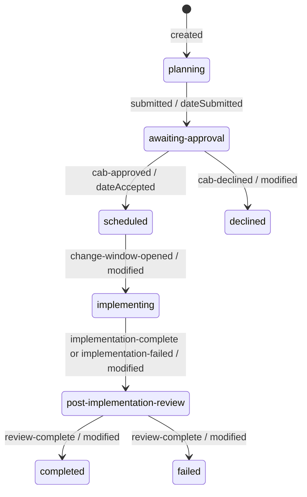

# Workflows

Each policy in `lifecycle-policies.json` is a small state machine: the statuses
a type of work may hold, the transitions allowed between them, the events that
trigger each transition, and the roles that approve it.

The right lifecycle depends on the kind of work, and so do the people involved.
Three conformance examples show three very different shapes:

| Kind of work | Example | Moves | Who moves it | Who approves | Typical tool |
| --- | --- | --- | --- | --- | --- |
| **Governance documents**: initiatives, decision records, designs | [`governance-documents.json`](0.9/examples/valid/governance-documents.json) | A few times over months | The author | A small group of senior roles | Confluence pages, documents in a repository |
| **Delivery work**: stories and bugs on a Kanban board | [`kanban-delivery.json`](0.9/examples/valid/kanban-delivery.json) | Many times a day | The team doing the work | The product owner, at acceptance only | Jira Software board |
| **Operations**: runbooks and change requests | [`operational-runbooks.json`](0.9/examples/valid/operational-runbooks.json) | In cycles, never finished | Engineers and on-call staff | People who did not do the work | Confluence runbooks, Jira Service Management |

The same format holds all three. One file can mix them, or a repository can
keep one file per team. The statuses, triggers and roles below come from the
examples; the standard requires the shape, not these names.

Each transition is labelled **trigger / Dublin Core term**: the events that may
cause it, then the term the governed item SHOULD record when it happens (see
[terms for the governed documents](dublin-core.md#terms-for-the-governed-documents)).

## Governance documents

Long-lived records of intent and decisions. They rarely move, every move
matters, and approval sits with a few senior roles. Nothing is deleted: a dead
decision is superseded and names its successor.

### Initiative

Approvers: `architect`, `productOwner`, `deliveryLead`. There is no
"delivering" status: an initiative stays `approved` while the delivery work
under it moves.

### Decision record

Approvers: `architect`, `productOwner`, `technicalLead`. The policy's
`extensions` map each status to a Confluence page status (Rough draft, Ready
for review, Verified) for teams that keep decision records in Confluence.

### Design

Approvers: `architect`, `technicalLead`. `"from": "*"` lets a design be
superseded from any status.

## Delivery work on a Kanban board

Short-lived items pulled across a board by the people doing the work. Most
moves need no approval; the one that does is acceptance. The example is
modelled on a Jira Software Kanban project, so the field is `status` and the
statuses follow its columns: Backlog, Selected for Development, In Progress,
In Review, Done. The triggers are the team's own events, declared in the
file's vocabulary, because the core events (`decision`, `checkpoint`,
`milestone`) describe governance, not flow.

### Story

Approvers: `productOwner`, for acceptance. Developers move a story freely up
to In Review. Any story can return to the backlog when it is deprioritised.

The example also shows how Jira-specific detail travels in `extensions`
without changing the standard: each policy names its Jira issue type and maps
every status to a Jira status category (To Do, In Progress, Done), some
transitions carry the Jira transition name, and the file records the board's
work-in-progress limits. See [Jira mapping](jira.md). The `bug` policy in the
same file has a shorter flow and a different approver, the `teamLead`, who
also declines bugs that will not be fixed.

## Operations: runbooks and change requests

Operational lifecycles are about trust under pressure, so they separate the
people who write or do the work from the people who approve it.

### Runbook

Approvers: `serviceOwner`, `onCallLead`: the people who will follow the
runbook during an incident, not the people who wrote it. A runbook is never
finished. It returns for review on a schedule (`extensions.reviewIntervalDays`)
and after every incident that used it, and it can be retired from any status
when its service is decommissioned.

### Change request

Approvers: `changeManager`, `changeAdvisoryBoard`. Modelled on a typical IT
change-management workflow such as Jira Service Management change requests:
approval is separate from implementation, a site reliability engineer does
the work inside an agreed change window, and every change is reviewed
afterwards, whether it worked or not.

## Writing your own

- Start from the example closest to your kind of work, then rename statuses,
  triggers and roles to match your team's words.
- List every status in `validStatuses`; a transition may only use declared
  statuses ([LP001](spec.md#semantic-rules)).
- Use `"from": "*"` for a move allowed from any status, such as withdrawing,
  deprioritising or retiring.
- Declare your own trigger events in `vocabulary.triggeredBy.active` when the
  core events do not describe your process ([LP002](spec.md#semantic-rules)),
  and every approver role in `vocabulary.roles` ([LP003](spec.md#semantic-rules)).
- Put anything else your tools need, such as Jira mappings, review intervals
  or risk levels, in `extensions`.

---

Licensed Apache-2.0, see [LICENSE.md](../LICENSE.md).

