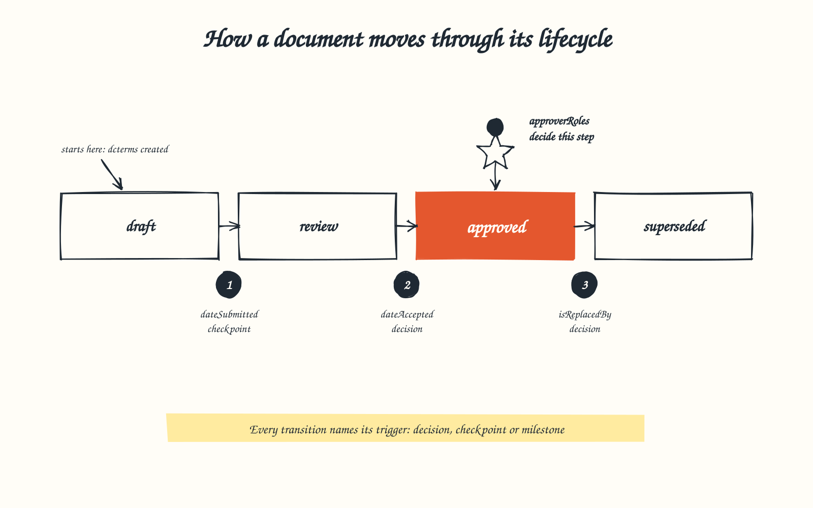
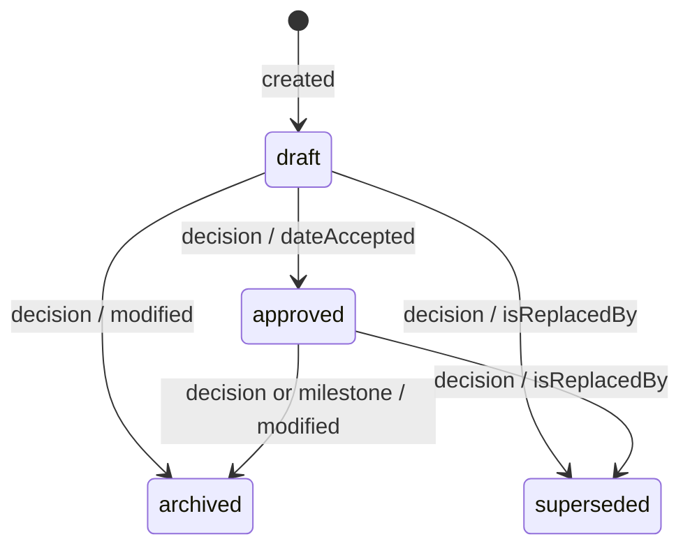
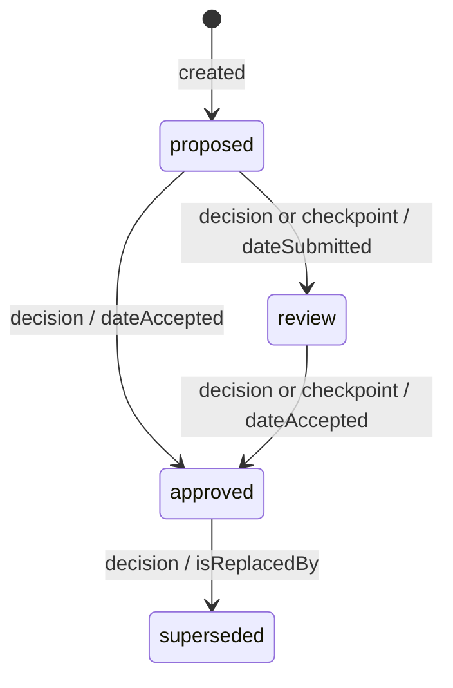
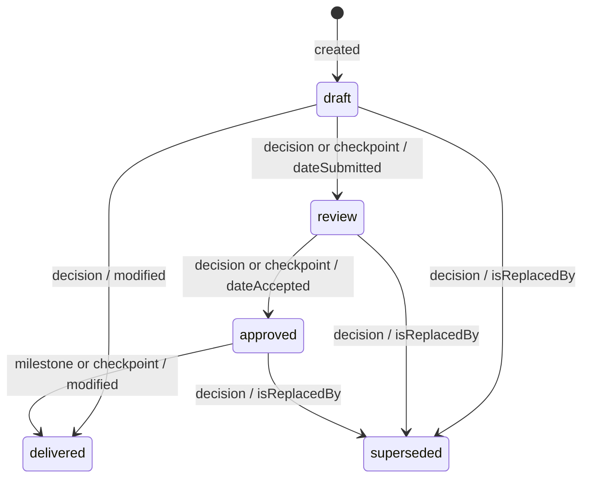
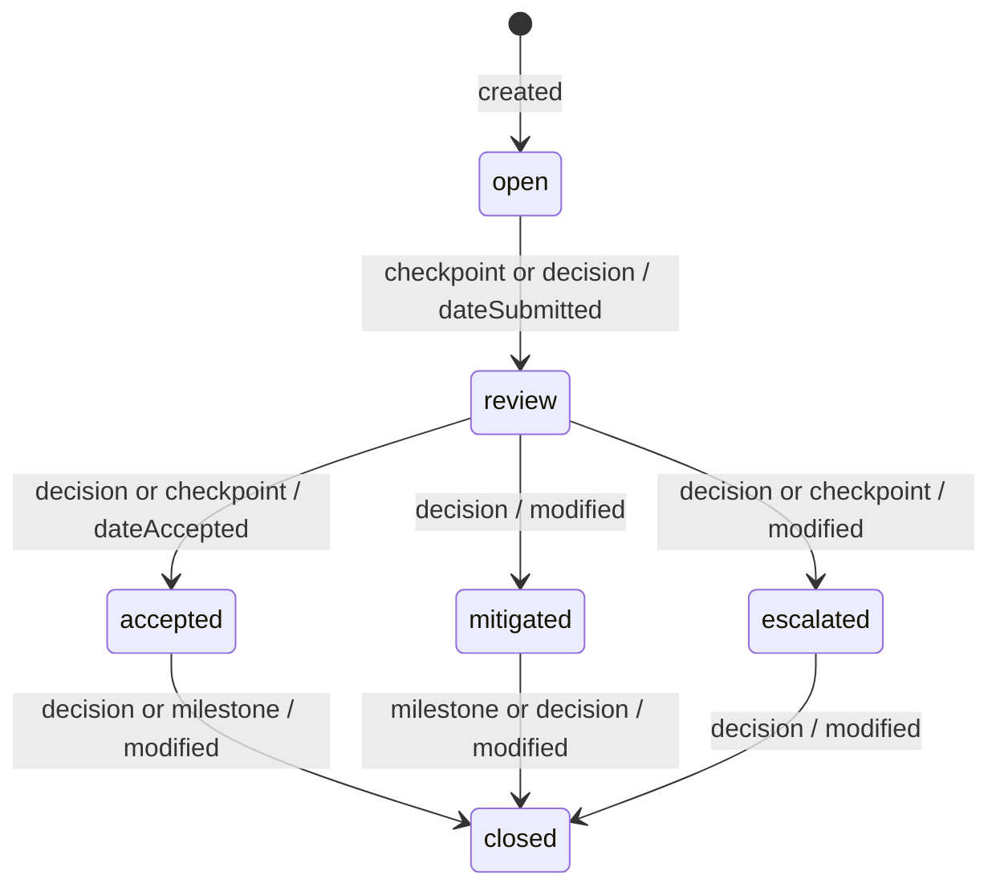

# Workflows

Each policy in `lifecycle-policies.json` is a small state machine: the statuses
a document type may hold, and the transitions allowed between them. These four
are real policies, taken from the conformance examples
[`githerd.json`](0.9/examples/valid/githerd.json) (initiative, decision record,
design) and [`gelato.json`](0.9/examples/valid/gelato.json) (risk).

Each transition is labelled **trigger / Dublin Core term**: the events that may
cause it, then the term the document SHOULD record when it happens (see
[terms for the governed documents](dublin-core.md#terms-for-the-governed-documents)).
The statuses are examples. The standard requires the shape, not these names.

## Initiative

Approvers: `architect`, `productOwner`, `deliveryPlanning`. There is no
"delivering" status: an initiative stays `approved` while work is in flight.

## Decision record (ADR)

Approvers: `architect`, `productOwner`, `technicalLead`. An approved decision is
never archived; a dead one is superseded by its successor.

## Design

Approvers: `architect`, `technicalLead`.

## Risk

Approvers: `architect`, `productOwner`. Severity levels are repository-specific,
so they live in the policy's `extensions`:
`{ "severityLevels": ["low", "medium", "high", "critical"] }`.

## Writing your own

- List every status in `validStatuses`; a transition may only use declared
  statuses ([LP001](spec.md#semantic-rules)).
- Use `"from": "*"` for a move allowed from any status, such as withdrawing a
  document.
- Name triggers from your vocabulary, or from the core events `decision`,
  `checkpoint` and `milestone` ([LP002](spec.md#semantic-rules)).
- Put anything else your tools need, such as severity levels or review
  deadlines, in `extensions`.

---

Licensed Apache-2.0, see [LICENSE.md](../LICENSE.md).

