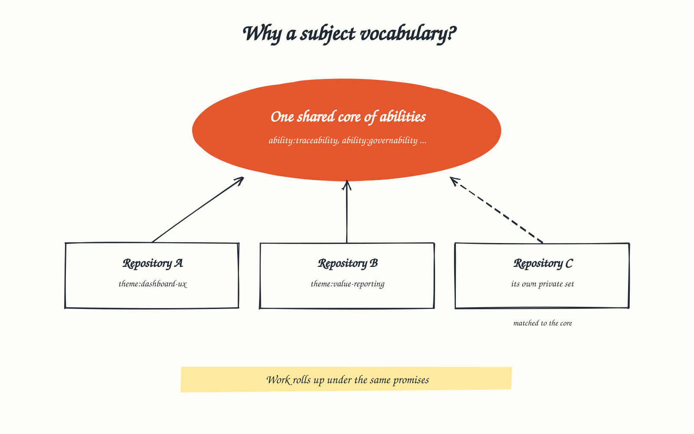
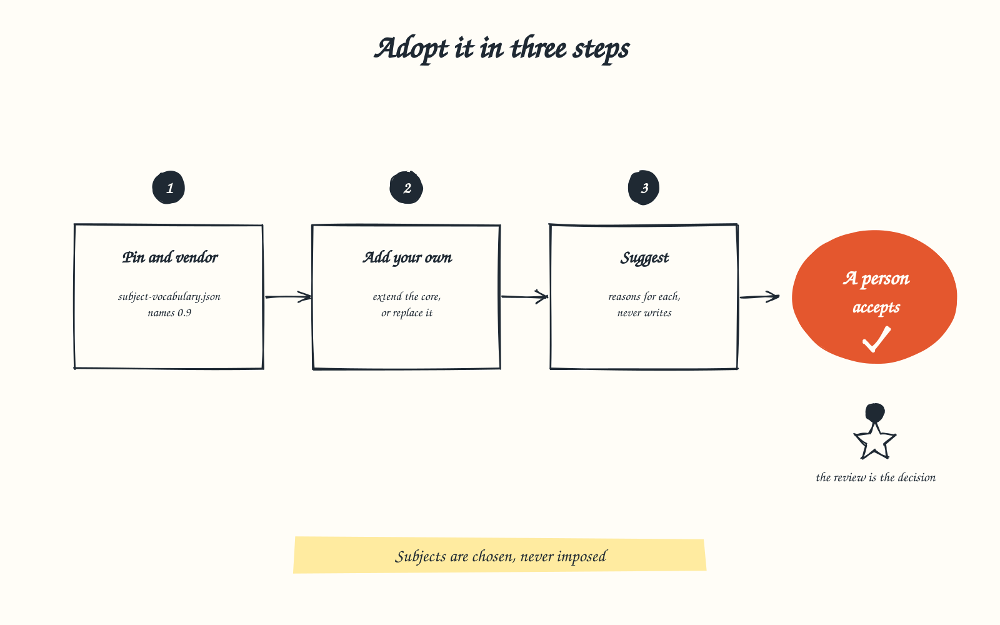
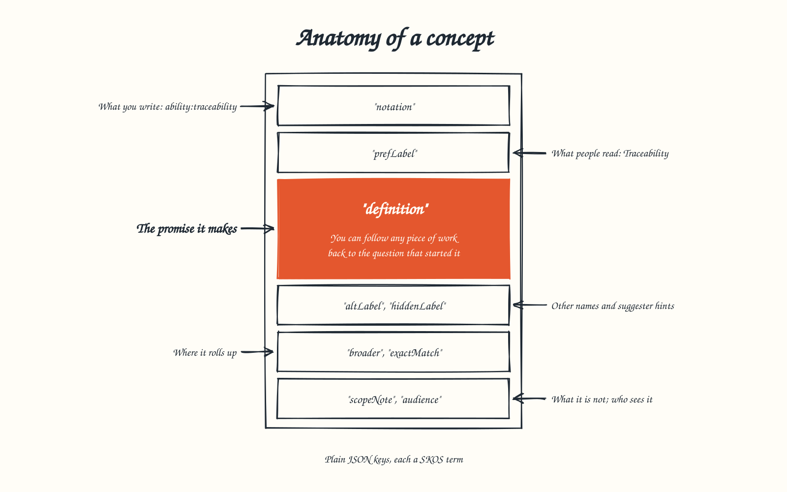

# Subject Vocabulary Standard

**Version 0.9, pre-release.** Published for testing before 1.0.

Most repositories tag their documents, and most tags drift: the same idea is
written five ways, a component sits beside a capability beside a document
type, and half the tags are used once. The Subject Vocabulary Standard gives
the Dublin Core `subject` key a shared vocabulary: a small core of
**abilities** (what the product promises the person using it), which every
repository can use, and a register in each repository for its own themes and
components. A subject written as `ability:traceability` then means the same
thing in every repository that adopts the standard, and work from all of them
rolls up under the same promises.

Each concept is a [W3C SKOS](https://www.w3.org/TR/skos-reference/) concept in
plain JSON: the notation you write, the label people read, the promise it
makes, its other names and the hints a suggester looks for.

## Who it is for

- **Repository maintainers** who want subjects that group work by what it
  delivers, not by who happened to tag it.
- **Authors, people and agents** who want to know which word to write instead
  of inventing one.
- **Tool builders**: dashboards that roll work up, validators, and suggesters
  that propose subjects with reasons for a person to accept.

## Adopt it

See [Adopt](adopt.md) for the steps: pin a released version, keep a copy of
it, add your own concepts or replace the core with your own set, and check
the register offline with the guard that ships with the standard.

## What a concept holds

## Read more

- [Specification](spec.md): the register, the concept shape, the rules, versioning.
- [The core scheme](scheme.md): the eight concepts of version 0.9.
- [Resolution](resolve.md): how a subject token resolves to a concept.
- [Suggestion](suggest.md): how a suggester proposes subjects, and its measured recall.
- [Adopt](adopt.md): adopting the standard in a repository.

## Files for version 0.9

| File | What it is |
| --- | --- |
| [`subject-vocabulary.schema.json`](0.9/subject-vocabulary.schema.json) | JSON Schema of a repository's adoption register |
| [`scheme.schema.json`](0.9/scheme.schema.json) | JSON Schema of the core scheme, and the shared concept shape |
| [`suggestions.schema.json`](0.9/suggestions.schema.json) | JSON Schema of a suggester's output and an acceptance record |
| [`scheme.json`](0.9/scheme.json) | The core scheme |
| [`context.jsonld`](0.9/context.jsonld) | JSON-LD context mapping keys to Dublin Core and SKOS |
| [`check/Test-SubjectVocabulary.ps1`](0.9/check/Test-SubjectVocabulary.ps1) | The adopter guard: schema and rules, offline |
| [`resolve/Resolve-Subject.ps1`](0.9/resolve/Resolve-Subject.ps1) | The reference resolver |
| [`suggest/Suggest-Subjects.ps1`](0.9/suggest/Suggest-Subjects.ps1) | The reference suggester |
| [`examples/`](https://github.com/Jamie-Clayton/githerd-rules/tree/main/subject-vocabulary/0.9/examples) | Valid and invalid conformance examples |

---

Licensed Apache-2.0, see [LICENSE.md](../LICENSE.md).
